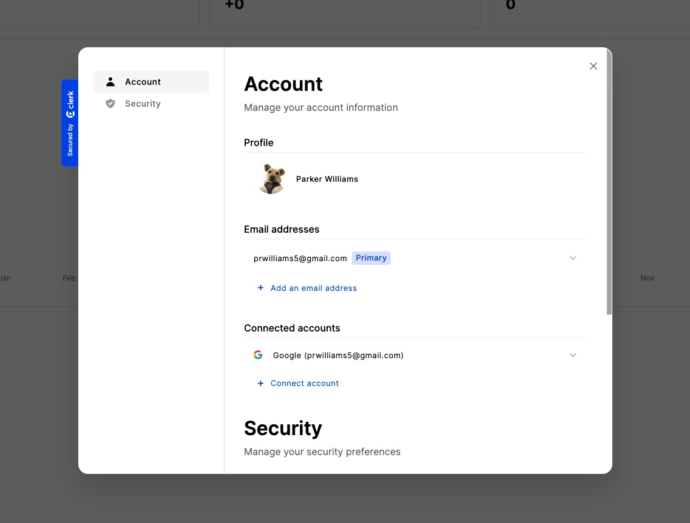
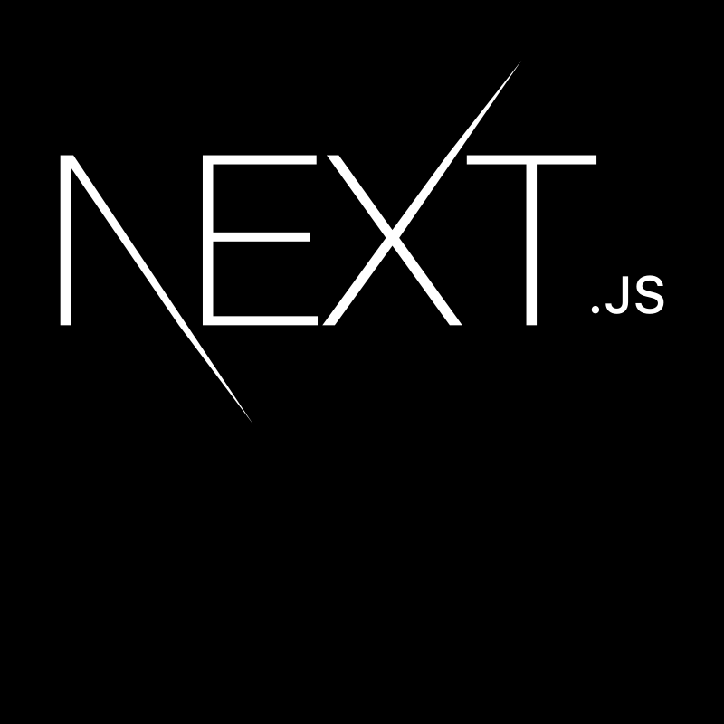

# AMSdash: Next-Generation Asset Management System

AMSdash is built to redefine asset management in the physical and virtual data center. By leveraging cutting-edge technology and adhering to rigorous compliance standards, AMSdash aims to deliver efficiency, innovation, and scalability for today's dynamic business environment. With a focus on adaptability and a commitment to excellence, AMSdash is designed to seamlessly integrate with existing systems while providing a robust platform for future growth.

 

## Core Stack

  
  
  
  
  
  
  
  
  

 

- **Next.js, & TypeScript**: Statically typed with server-side rendering for efficient and powerful development
- **shadcn/ui**: Modern and responsive, React-based, modular UI
- **SQL Database**: Prisma and MySQL
- **Express**: Node.js back-end to communicate with external APIs
- **Docker Compose & Ansible**: Container orchestration for streamlined deployment and management

<<<<<<< HEAD

## Outline

=======

### Security & Compliance

- Compliance with legal and regulatory frameworks
- Robust security architecture, following industry best practices

## Outline & Roadmap

Phases 1-3 are planned to be about 6 months each, phase 4 would be an additional year or more.

### Phase 1: Core Functionality

#### Security & Compliance

- Compliance with legal and regulatory frameworks
- Robust security architecture, following industry best practices

#### User Management & Authentication

- Role-based access control
- OAuth integration for third-party authentication

#### Access List

- Security access management with detailed logging
- Door access control API integration
- Compliance alignment with regulations

#### Asset Management Dashboard

- Real-time inventory management
- Data analytics integration for actionable insights

### Phase 2: Advanced Features

#### AI-Driven Monitoring & Analytics

- Live monitoring of power, network, and systems
- Predictive analytics powered by machine learning library TensorFlow

  

#### Ticketing System Integration

- Seamless integration with in-house or third-party ticketing systems
- Automated ticket creation, tracking, and resolution

#### Self-Service Automation & Orchestration

- Intelligent automation for resource scaling
- API-driven management capabilities

### Phase 3: Premium Enhancements & Customer Interaction

#### Customer Purchase Platform

- End-to-end eCommerce solution
- Secure payment processing with Stripe integration

#### Sustainability & Energy Efficiency Reporting

- Energy consumption monitoring
- Recommendations for eco-friendly operations

### Phase 4 & Beyond: Future Opportunities

- Replacement for cloud orchestration solutions
- User Engagement & Personalized Experience
- Customizable White-Label Solutions
- Integrated Virtual Network Operations Center (NOC)
  - 3D visualization and AR support
  - Interactive asset management interface

Any suggestions for improvements are more than welcome!
